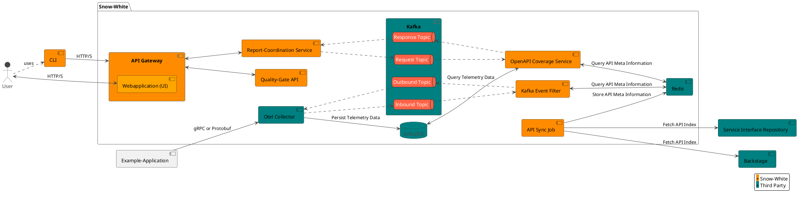

# Developer Setup Guide

Welcome, and thank you for considering to contribute to **Snow-White**!
This guide walks you through setting up your development environment and building the services.
If you run into any issues, please open an issue or contact the maintainers.

## Quick Start

### 1. Prerequisites

- Java 21 installed
- Node.js 22 installed
- Docker or Podman (with Compose) installed

### 2. Launch the Development Environment

Start all required services using Docker/Podman Compose:

```shell
docker compose -f dev/docker-compose.yaml up -d
```

This includes InfluxDB, Kafka, OTEL Collector, Redis, and supporting UI tools.
For more on which services are running and their ports, see [Mapped Ports](#mapped-ports).

### 3. Configure InfluxDB Access

You'll need a **Read/Write token** for the raw-data bucket in InfluxDB.

1. Visit the InfluxDB UI (port 8086)
2. The login is `snow-white:snow-white`
3. Create a token with both `read` and `write` into the `raw-data` bucket
4. Add the token to your `dev/.env` file:

```ini
INFLUXDB_TOKEN=[YOUR_TOKEN_GOES_HERE]
```


Restart the environment for changes to take effect:

```shell
docker compose -f dev/docker-compose.yaml down && docker compose -f dev/docker-compose.yaml up -d
```

## Architecture Overview

**Snow-White** follows an event-driven architecture.
The below diagram includes all microservices and their connections.



### Microservices

Each microservice completes a specific task.

| Microservice                                                               | Intent                                                                                                                                                                                |
| -------------------------------------------------------------------------- | ------------------------------------------------------------------------------------------------------------------------------------------------------------------------------------- |
| [API Gateway](./microservices/api-gateway)                                 | Handles incoming HTTP requests and routes them to internal services.                                                                                                                  |
| [API Sync Job](./microservices/api-sync-job)                               | Periodically fetches API definitions from various sources and stores metadata for reference.                                                                                          |
| [Kafka Event Filter](./microservices/kafka-event-filter)                   | An optional service, in addition to the Open-Telemetry collector. Filters telemetry events from Kafka topics based on whether they're applicable for processing by Snow-White or not. |
| [OpenAPI Coverage Service](./microservices/openapi-coverage-service)       | Analyzes the coverage of actual API usage against declared OpenAPI specifications                                                                                                     |
| [Quality-Gate API](./microservices/quality-gate-api)                       | Handles quality gate evaluations and criteria management.                                                                                                                             |
| [Report Coordination Service](./microservices/report-coordination-service) | Coordinates data aggregation and reporting logic across the application.                                                                                                              |

### Building and Running Services

Use the following steps for rapid local development:

1. Build all modules:

   ```shell
   ./mvnw package -T1C
   ```

2. Start the Docker environment (if not already running):

   ```shell
   docker compose -f dev/docker-compose.yaml up -d
   ```

3. Stop the microservice you want to develop and run it manually:

   ```shell
   ./mvnw spring-boot:run -pl :<microservice-name>
   ```

### Mapped Ports

| Service                                                                      | Spring Boot (`dev` profile) | Docker (or Podman) Compose (`docker-compose.yaml`) |
| ---------------------------------------------------------------------------- | --------------------------- | -------------------------------------------------- |
| [`example-application`](./example-application)                               | `8080`                      | `8080`                                             |
| [`api-gateway`](./microservices/api-gateway)                                 | `9080`                      | `80`                                               |
| [`api-sync-job`](./microservices/api-sync-job)                               | -                           | -                                                  |
| [`kafka-event-filter`](./microservices/kafka-event-filter)                   | -                           | -                                                  |
| [`openapi-coverage-service`](./microservices/openapi-coverage-service)       | -                           | -                                                  |
| [`quality-gate-api`](./microservices/quality-gate-api)                       | `8081`                      | `8081`                                             |
| [`report-coordination-service`](./microservices/report-coordination-service) | `8084`                      | `8084`                                             |

The UI Development Server (used by `api-gateway`) is available on port `9001`.

### Additional Services

These services are only available inside Docker (or Podman) Compose:

| Service                      | Ports                                                    |
| ---------------------------- | -------------------------------------------------------- |
| OTEL Collector               | `1888`, `8888`, `8889`, `13133`, `4317`, `4318`, `55679` |
| Kafka                        | `9092`, `9094`                                           |
| Kafka UI                     | `8090`                                                   |
| Redis                        | `6379`                                                   |
| Redis Insight                | `5540`                                                   |
| InfluxDB                     | `8086`                                                   |
| PostgreSQL                   | `5432`                                                   |
| Service Interface Repository | `3000`                                                   |

## Running Tests and Code Quality

Run all unit/integration tests and aggregate coverage:

```shell
./mvnw verify -T 1C
```

To run a [SonarQube](https://www.sonarsource.com/) analysis:

1. Start Sonar:

   ```shell
   docker compose -f dev/sonar.yaml up -d
   ```

2. Create a new Sonar project (`snow-white`) and token.

   The initial login to http://localhost:9000 can be done with `admin:admin`.
   The password must be changed at first login.

   Enter into SonarQube and add a new project called `snow-white`.
   Choose manual setup with a local build environment.
   This will lead you up to the token generation.
   Create a token with a name of your choice, but select "No expiration date".

3. Run the analysis:

   ```shell
   ./mvnw jacoco:report-aggregate sonar:sonar -Dsonar.login=${SONAR_TOKEN}
   ```

## Native Builds

These microservices support native image builds:

- `kafka-event-filter`
- `quality-gate-api`
- `report-coordination-service`

Build an image using:

```shell
./mvnw -am -pl :<maven-module> -T1C install
./mvnw -DskipTests -Pnative -pl :<maven-module> spring-boot:build-image
```

Build all native microservices:

```shell
./mvnw -T1C install
./mvnw -DskipTests -Pnative -T1C -pl :kafka-event-filter,:report-coordination-service,:quality-gate-api spring-boot:build-image
```

For development, override `-Dimage.tag=latest` to build a "latest" image for usage with [Docker/Podman Compose](#quick-start).
Podman is supported using the `podman` profile as well.

## Maven Proxy Setup

If you're behind a corporate proxy, use the following snippet in `.mvn/settings.xml`:

```xml
<settings>
  <mirrors>
    <mirror>
      <id>central-mirror</id>
      <name>...</name>
      <url>...</url>
      <mirrorOf>central</mirrorOf>
    </mirror>
    <mirror>
      <id>confluent-mirror</id>
      <name>...</name>
      <url>...</url>
      <mirrorOf>confluent</mirrorOf>
    </mirror>
  </mirrors>
</settings>
```

Make sure to add this to `.mvn/settings.xml` (this file is gitignored).
