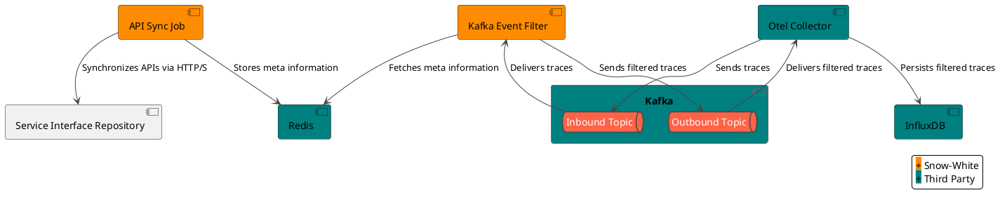

<h1 align="center">Snow-White 🍎</h1>

    <i>An awesome pairing with, well.. do you know Snow White and the Jaeger?</i>

Snow-White makes API testing effortless by leveraging API specifications and [OpenTelemetry (OTEL)](https://opentelemetry.io/) data.
OTEL is a standardized protocol that allows flexible data sourcing.

Most commonly, Snow-White listens to **black-box tests of your application**, such as system or integration tests.
However, it can also gather insights from a **live production environment**.

Snow-White provides valuable insights on:

- Coverage
- API Performance
- And more.

## Architecture

